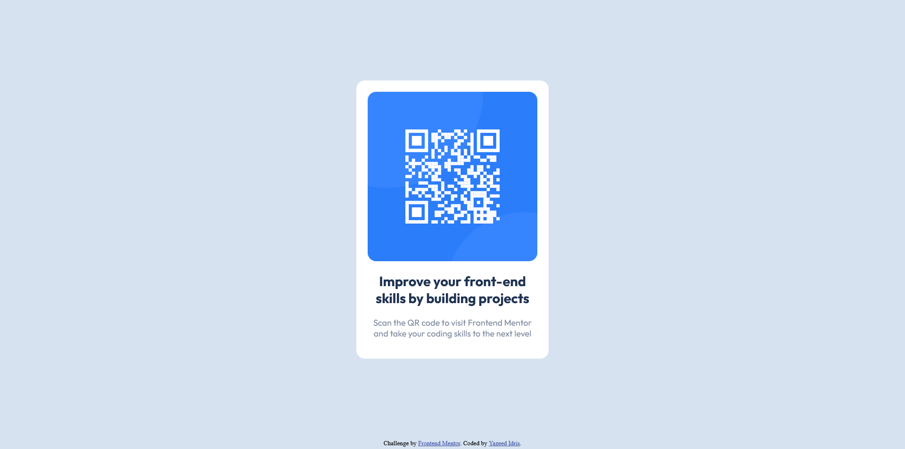

# Frontend Mentor - QR code component solution

This is a solution to the [QR code component challenge on Frontend Mentor](https://www.frontendmentor.io/challenges/qr-code-component-iux_sIO_H). Frontend Mentor challenges help you improve your coding skills by building realistic projects. 

## Table of contents

- [Overview](#overview)
  - [Screenshot](#screenshot)
  - [Links](#links)
- [My process](#my-process)
  - [Built with](#built-with)
  - [What I learned](#what-i-learned)
  - [Continued development](#continued-development)
  - [Useful resources](#useful-resources)
- [Author](#author)

## Overview

### Screenshot

### Links

- Solution URL: (https://github.com/Yazeed-Idris/qr-code-component-main.git)
- Live Site URL: (https://yazeed-idris.github.io/qr-code-component-main)

## My process

### Built with
- HTML
- JavaScript
- CSS

### What I learned

Taking the time to make small changes without rushing to complete the challenge certainly made the site look better.

### Continued development

I would like to improve the fonts of the site by making the font size more responsive to the screen size

### Useful resources

- [Example resource 1](https://www.w3schools.com/howto/howto_css_image_responsive.asp) - This site is the goto when it comes to making responsive designs.

## Author

- Frontend Mentor - [@Yazeed-Idris](https://www.frontendmentor.io/profile/Yazeed-Idris)
- LinkedIn - [@Yazeed-Idris](https://www.linkedin.com/in/yazeed-idris)
